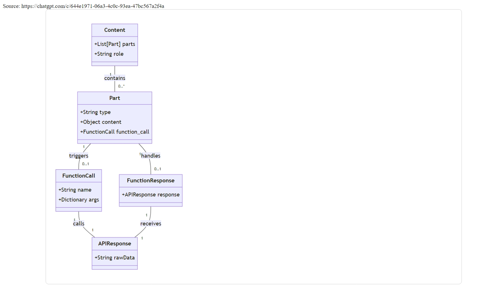
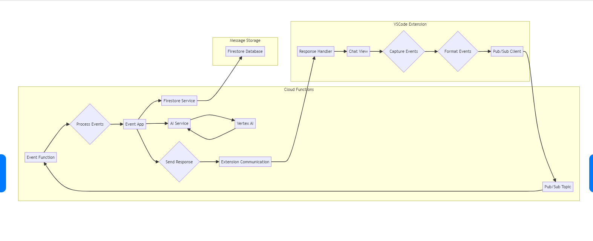

## local test before deployment
while using functions-framework, can setup a local server to test the function locally,
get key from the gcloud sec manager and set the terminal env
manage the test script and test data.json file.
```
eval $(npx ts-node ts/secmanager.ts) && npm run serve
```
```
curl -X POST -H "Content-Type: application/json" --data @data.json https://us-central1-gen-lang-client-0714220459.cloudfunctions.net/codebot
```

## generate a help site for start a first vertex project in gcloud, 




## integrate into shell context
echo '
codebot() {
  curl -s -X POST -H "Content-Type: application/json" --data '{"bot":"claude", "text":"'"$*"'"}' https://us-central1-gen-lang-client-0714220459.cloudfunctions.net/codebot| jq -r 
}
' >> ~/.bashrc && source ~/.bashrc